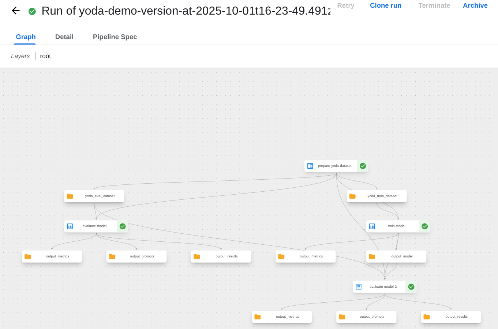

## IBM TechXchange 2025 – Yoda Translator 🤖🌌

A Kubeflow Pipelines (KFP) demo that fine-tunes a base LLM on a Yoda-speech
dataset, evaluates baseline vs fine-tuned models, and serves a simple FastAPI
web app to translate text into Yoda speak via an OpenAI-compatible inference
endpoint.

---

### Contents 🧭

- What’s included
- Prerequisites
- Development environment
- Pipeline: yoda_finetune_and_evaluate
- App: FastAPI + static UI
- Configure API URLs
- Local run
- Kubernetes/Openshift deploy
- Troubleshooting

---

### What’s included 📦

- Pipeline definition: `yoda_finetune_and_evaluate_pipeline.py`
- Components library: `components/` (dataset prep, training, evaluation)
- Web app: `app/` (FastAPI backend + static HTML/JS/CSS)
- Deployment manifests: `k8s/` (app and KServe InferenceService + Route)
- Container build: `Dockerfile`

---

### Prerequisites ⚙️

- Python 3.10+
- Access to a Kubernetes/OpenShift cluster if deploying
- Kubeflow Pipelines and KServe installed on the cluster if running end‑to‑end
- A Hugging Face token if using gated models (e.g., Llama); stored as a
  Kubernetes secret `hf-token` with key `HF_TOKEN` for cluster runs

---

### Development environment 🧑‍💻

Follow the repo’s development tips:

- Use the Python virtualenv in `.venv`. If it does not exist, create it and
  install `kfp` and `kfp-kubernetes`.
- Prefer reusing components from `components/README.md`.
- Pipeline parameter rules:
  - Do not use Union types
  - Use Google‑style docstrings
  - Optional inputs must have `= None` or a default value
- Always include a compile block in pipeline files (this repo already does).

Create and activate a venv, then install requirements for the app and pipeline
authoring:

```bash
python -m venv .venv
source .venv/bin/activate
pip install -r app/requirements.txt
pip install kfp kfp-kubernetes
```

---

### Pipeline: `yoda_finetune_and_evaluate` 🧪

**Requires: KFP 2.15+**

Location: `yoda_finetune_and_evaluate_pipeline.py`

Purpose: prepare a Yoda dataset, fine‑tune a base model using LoRA, and evaluate
both baseline and fine‑tuned models.

Key steps:

- Prepare dataset splits via `components.prepare_yoda_dataset`
- Train LoRA adapter via `components.train_model` (PVC-backed workspace)
- Evaluate baseline model via `components.evaluate_model`
- Evaluate fine‑tuned (baseline + LoRA adapter) via `components.evaluate_model`

Inputs (parameters):

- `model_name: str = "meta-llama/Llama-3.2-3B-Instruct"`
- `eval_limit: int = None` (evaluate all when `None`)

Runtime notes:

- Both evaluation steps request a GPU and sufficient CPU/memory
- HF token is injected from the `hf-token` secret for gated models
- The pipeline includes a compile block:

```python
if __name__ == "__main__":
    from kfp import compiler

    compiler.Compiler().compile(
        pipeline_func=yoda_finetune_and_evaluate,
        package_path=__file__.replace(".py", ".yaml"),
    )
```

Compile check (recommended before submitting to KFP):

```bash
source .venv/bin/activate
python yoda_finetune_and_evaluate_pipeline.py
# Produces yoda_finetune_and_evaluate_pipeline.yaml
```

Reusable components docs live in `components/README.md` (dataset prep, training,
evaluation usage and parameters).



---

### App: FastAPI + static UI 🖥️

Location: `app/`

- Backend: `app/main.py`
  - Exposes `POST /api/chat` that forwards OpenAI‑compatible chat requests to a
    configured KServe/OpenAI endpoint
  - Environment variables:
    - `KSERVE_URL` (default in code points at an example OpenShift Route)
    - `MODEL_ID` (default: `yoda-llm`) – used if the client payload omits
      `model`
- Frontend: `app/static/` (`index.html`, `script.js`, `styles.css`)
  - `script.js` calls `/api/chat` from the same origin

Run the app locally:

```bash
source .venv/bin/activate
uvicorn app.main:app --host 0.0.0.0 --port 8080
# Open http://localhost:8080
```

---

### Configure API URLs 🌐

There are two URLs to be aware of:

- App’s API endpoint (browser -> app): fixed at `/api/chat` in the frontend
- Upstream OpenAI‑compatible endpoint (app -> model serving): configured via
  `KSERVE_URL`

Configure `KSERVE_URL` to point at your KServe or other OpenAI‑compatible
endpoint. Examples:

Local dev (if you have an externally reachable OpenAI‑compatible endpoint):

```bash
export KSERVE_URL="https://<your-kserve-route>/openai/v1/chat/completions"
export MODEL_ID="yoda-llm"
uvicorn app.main:app --host 0.0.0.0 --port 8080
```

Kubernetes/OpenShift (via Deployment env in `k8s/app.yaml`):

```yaml
- name: KSERVE_URL
  value: "https://<your-kserve-route>/openai/v1/chat/completions"
- name: MODEL_ID
  value: "yoda-llm"
```

The frontend does not need to know `KSERVE_URL`; it only calls `/api/chat`. The
FastAPI service proxies requests to `KSERVE_URL` and injects `model` as
`MODEL_ID` if missing.

---

### Local run ▶️

- Ensure `KSERVE_URL` is set to a valid OpenAI‑compatible chat completions
  endpoint
- Start the app:

```bash
source .venv/bin/activate
uvicorn app.main:app --host 0.0.0.0 --port 8080
```

- Open the UI at `http://localhost:8080`, enter text, and click Translate

Optional: point to a self‑hosted KServe route created from `k8s/kserve.yaml`
(see below).

---

### Kubernetes/OpenShift deploy ☸️

App deployment (`k8s/app.yaml`):

- Creates `Namespace`, `Deployment`, `Service`, and `Route` (OpenShift)
- Set `image` to your built image
- Update `KSERVE_URL` and `MODEL_ID` as needed

Apply:

```bash
oc apply -f k8s/app.yaml
# Or kubectl for clusters without OpenShift Route (replace with Ingress)
```

Model serving via KServe (`k8s/kserve.yaml`):

- Defines an `InferenceService` named `yoda-llm` in `kubeflow-user-example-com`
- Points `storageUri` at a LoRA adapter directory in object storage. You'll need
  to change this value.
- Sets runtime args for vLLM/HF model; injects `HF_TOKEN` from secret
- Creates a Route named `yoda-predictor` for external access on OpenShift

After the `yoda-predictor` route is ready, build `KSERVE_URL` as:

```
https://<route-host>/openai/v1/chat/completions
```

Use that value in the app’s `KSERVE_URL`.

---

### Troubleshooting 🧰

- 4xx/5xx from `/api/chat`: check `KSERVE_URL` is reachable and correct; verify
  upstream expects OpenAI chat format
- Empty responses: increase `max_tokens` in the frontend payload or upstream
  server config
- GPU/memory errors in KServe: lower `--gpu-memory-utilization`,
  `--max-model-len`, or concurrency; confirm requested resources match nodes
- Gated models (e.g., Llama): ensure `HF_TOKEN` is present in the cluster and
  has access
